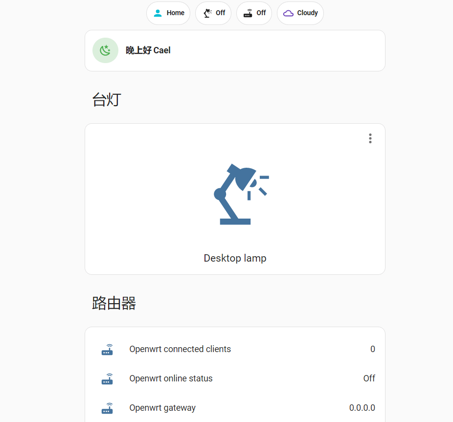
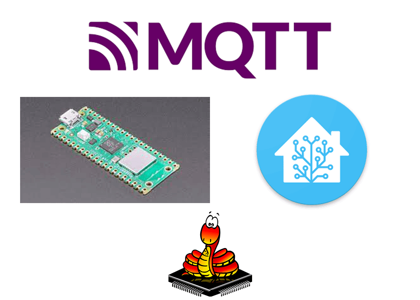

# IOT Lamp Based On MQTT

## 1. Preview

This is an IOT Lamp based on **MQTT** using **Pi Pico W** which written in **micropython** and backended with **homeassistant**.

## 2. Home Assistant

## 3. Stack

